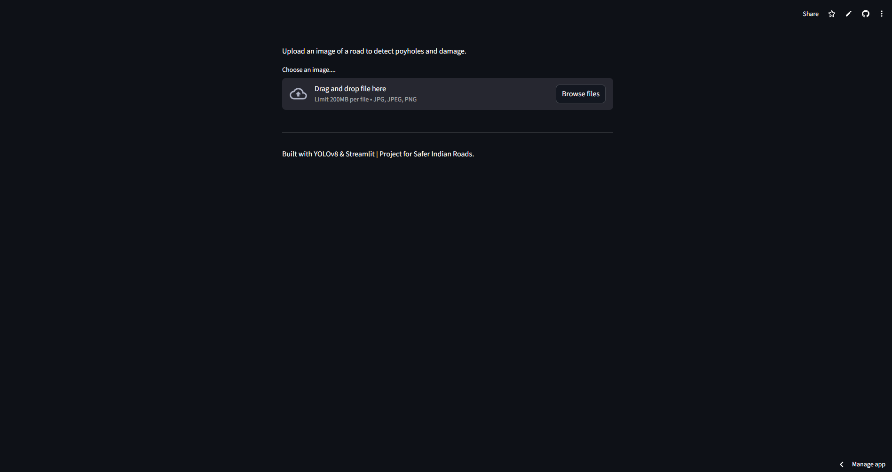

# Sadak-Sahayak--Road-helper-

# Installation Intructions:
    pip install -r requirement.txt

# Challenges Faced
1. Linux-Based Cloud Deployment Compatibility
    1.1 Challenge: Encountered ImportError: libGL.so.1 upon deploying to Streamlit Cloud because the server environment lacked the necessary graphics drivers for OpenCV.
    1.2 Solution: Implemented a packages.txt file to install libGL1 at the system level and switched to the opencv-python-headless library to ensure compatibility with a server environment.

2. Real-Time Inference Optimization
    2.1 Challenge: High-resolution image processing initially caused high latency, making "real-time" detection difficult in a free-tier environment.
    2.2 Solution: Utilized a Nano-model(YOLOv8n) architecture and optimized the inference pipeline, reducing detection time to under 200ms per image.